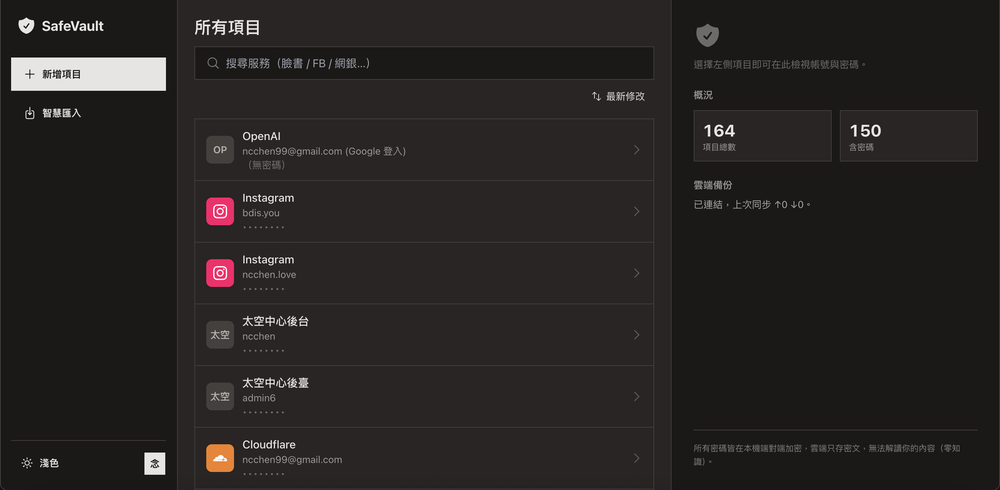

# SafeVault — 零知識智慧密碼管理器 (PWA)

端對端加密、可離線、可安裝的密碼管理器。**密碼明文與金鑰永不離開裝置**，伺服器只看得到密文。

支援 Google 一鍵 / 指紋免密碼上線、智慧貼上匯入、語意搜尋，以及跨裝置 E2EE 同步。

<p align="center">
  
</p>

<p align="center">
  
  
  
  
</p>

---

## ✨ 功能特色

### 🔐 真・零知識加密
- 所有密碼在裝置上以 **AES-256-GCM** 加密，金鑰由 **Argon2id**（hash-wasm，PBKDF2 fallback）從主密碼推導。
- 採金鑰包裝架構：主密碼／復原碼包裝的是同一把金庫金鑰 (VK)，**換主密碼只需重新包裝，金庫密文不必重算**。
- 金鑰為 **non-extractable**，僅存於記憶體；**閒置 5 分鐘自動上鎖**。
- 雲端只儲存密文與包裝後的金鑰，**伺服器與開發者都無法解密**。

### 🪪 免密碼上線（Passwordless）
- **Google 一鍵登入 + 指紋／FaceID 解鎖**，無需設定主密碼即可開始使用。
- 想加強保護時，可隨時於設定中為金庫補上主密碼解鎖。
- 跨裝置以**復原碼**還原金庫，免密碼也能安全漫遊。

### 📥 智慧貼上匯入
- 貼上**任意格式**的帳密文字（網站匯出、純文字筆記、亂序欄位皆可），全程**在本機解析**，內容不離開裝置。
- 解析管線：正規化 → 分段 → 有限狀態機 (FSM) → 評分 → **逐張卡片確認**，可逐筆檢視再入庫。
- 匯入時自動**比對既有條目並合併**，避免重複。

### 🔎 語意 + 模糊搜尋
- 內建**多語概念字典**（例如「網銀」≈「online banking」、「臉書」≈「FB」≈「Facebook」），找得到你記得的說法。
- 融合 lexical 模糊比對與別名，**零網路、可離線**運作。

### ☁️ 跨裝置 E2EE 同步
- 以 Firestore 同步**密文**，rev / baseRev **三方合併**，衝突自動產生 `conflictOf` 副本不覆蓋資料。
- **刪除墓碑 (tombstone)** 確保跨裝置刪除一致。
- 即時自動同步，設定頁可隨時手動「立即同步」並顯示上次同步進出筆數。

### 🎨 細緻的 UI / UX
- 自訂淺／深色 theme（DaisyUI，符合 **WCAG AA** 對比）、品牌圖示自動匹配。
- 條目支援**自訂欄位、備註、網址、標籤**，密碼預設遮蔽可一鍵顯示。
- 行動版硬體返回鍵導航、reduced-motion、focus ring 等無障礙打磨。

### 📲 可安裝的 PWA
- vite-plugin-pwa (Workbox)：service worker / manifest，**可安裝到桌面與主畫面、完整離線運作**。
- 內建 InstallPrompt 與一致的 theme-color。

### 🆘 忘記主密碼也能救
- 以**復原碼**重設主密碼，重設後舊碼立即失效。
- **無後門**：主密碼與復原碼同時遺失即無法復原（安全的代價）。

---

## 🔒 安全架構（金鑰包裝）

```
主密碼 ─Argon2id→ MEK ─wrap→ VK ─AES-GCM→ 金庫密文
復原碼 ─Argon2id→ RK  ─wrap→ VK（另一份，供復原）
```

- Firestore 只存 `kdfParams`、`wrappedVK_byMEK`、`wrappedVK_byRK`、條目密文。
- 加密綁定條目 id（AAD），並以單調遞增的 `vaultRev` 防回滾。
- 換主密碼只重包裝 VK，金庫密文不必重算。

---

## 🧰 技術堆疊

| 層面 | 技術 |
| --- | --- |
| 前端 | React 18 + TypeScript (strict) + Vite 6 |
| PWA | vite-plugin-pwa (Workbox) — SW / manifest / 可安裝 / 離線 |
| 樣式 | Tailwind CSS + DaisyUI（自訂淺/深色 theme，WCAG AA）+ Heroicons |
| 本地儲存 | IndexedDB via Dexie（只存密文） |
| 加密 | WebCrypto AES-256-GCM + Argon2id（hash-wasm，PBKDF2 fallback） |
| 狀態 | Zustand（VK 與解密資料僅存記憶體，閒置 5 分鐘自動上鎖） |
| 後端 | Firebase Auth (Google) / Firestore / Functions / Hosting / Emulators |

---

## 🚀 開發

```bash
npm install
npm run dev        # http://localhost:5173
npm test           # 加解密 / 搜尋單元測試
npm run build      # 產出 dist/（含 PWA SW）
npm run emulators  # Firebase Emulator Suite
```

---

## 🗺️ 里程碑

- [x] **M1** 專案骨架 + 本地 MVP：加密儲存、手動條目、別名+模糊搜尋、分割線清單 UI、深淺色、復原碼
- [x] **M2** 智慧匯入解析管線（normalization → segment → FSM → 評分 → 逐張確認卡片，全程本機）
- [x] **M3** E2EE Firestore 同步（rev/baseRev 三方合併 + conflictOf 衝突副本）+ Security Rules + 忘記主密碼流程（復原碼重設、舊碼失效）
- [x] **M4** 語意搜尋：多語概念字典（網銀 ≈ online banking）融合 lexical，零網路、可離線
- [x] **M5** a11y / 離線 / 安裝打磨：PWA 圖示、InstallPrompt、reduced-motion、focus ring、theme-color 一致
- [x] **M6** 免密碼上線：Google + 指紋無主密碼 onboarding、跨裝置復原碼還原、安全稽核修復

---

## 📌 待補

- CI（lint + test + build）— 可選
- Firestore Rules 測試 / Emulator 端對端：需 Java 執行環境啟動 Firestore Emulator
  （`npm i -D @firebase/rules-unit-testing` 後 `npm run test:rules`）
- 正式雲端同步：將 `.env` 的 `VITE_USE_EMULATORS` 改為 `false`
